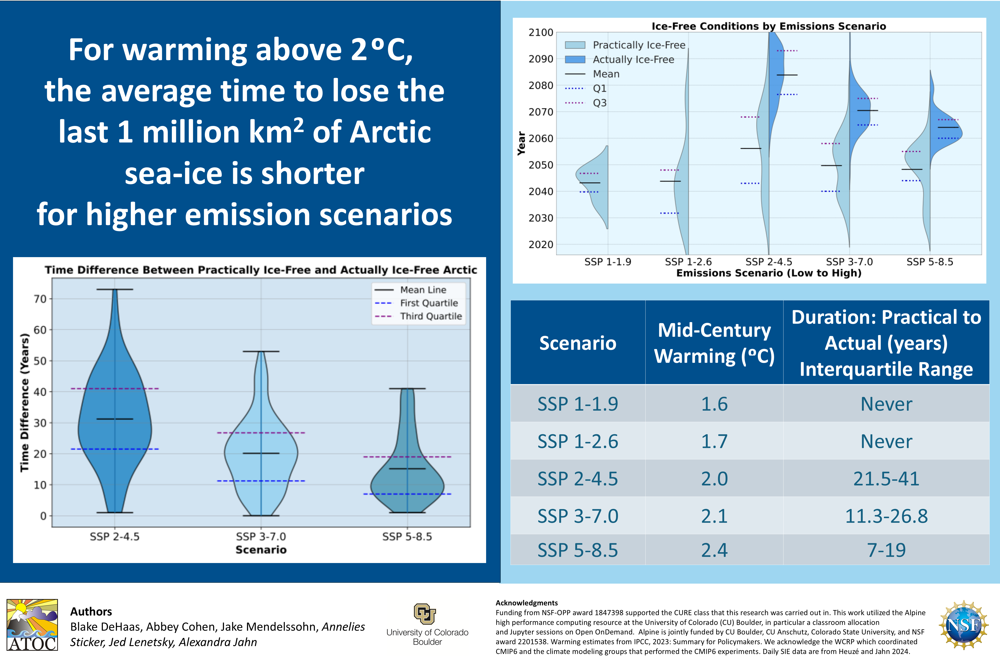

I had the incredible opportunity to lead an undergraduate research team this semester under the guidance of Dr. Alexandra Jahn of the Institute of Arctic and Alpine Research at CU Boulder. My team researched Arctic sea ice projections over the next century, and we presented our research at the Earth System and Space Science Poster Conference. This experience allowed me to gain hands-on experience working with geospatial simulations and performing large-scale data analysis using the CMIP6 climate models. I also was able to develop my leadership skills by managing a small research team, organizing our communication and work, and educating my team on coding and AI usage for scientific applications. This work was funded by a grant from the National Science Foundation and supported by the Department of Atmospheric and Oceanic Sciences at CU Boulder.

This research inspired me to explore the geopolitical implications for receding Arctic sea ice through the lens of the Athabascan tribe in Alaska, exploring themes of indigenous climate justice, sovereignty, and futurism. You can check out the early preview for Part 1 and Part 2 of this project here:

Part 1: The Department of Government Efficiency 
https://youtu.be/4fZEILOf2PU?si=mL4QO7Nw3NqPpYUs

Part 2: Post-Scarcity Indigenous Wisdom
https://youtu.be/waKiW__49-4?si=-749pnWU7H1EuaWs
